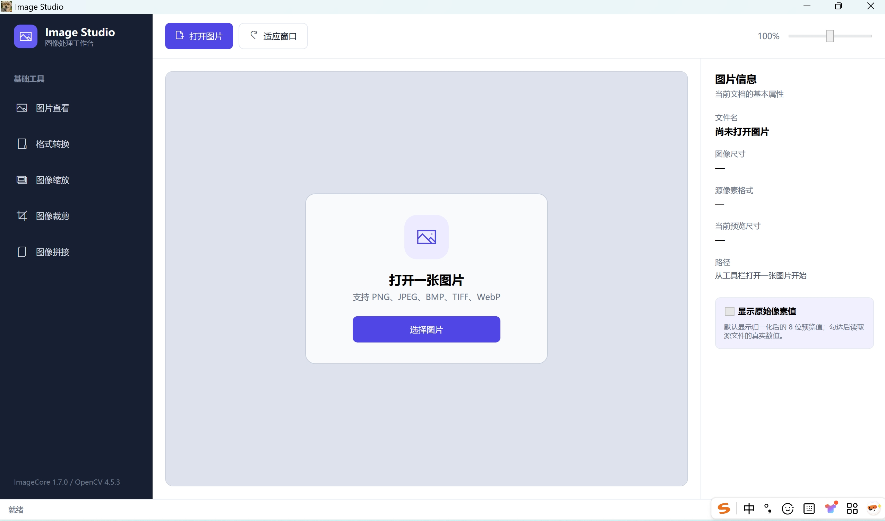

# Image Studio

Image Studio 是一个完全离线运行的 Windows 图像查看与处理工具。界面使用
C# / WPF，图像解码与处理使用 C++ / OpenCV。

## 界面展示



## 下载与运行

1. 在 GitHub 的 **Releases** 页面下载 `ImageStudio-win-x64-portable.zip`；
2. 将 ZIP 完整解压到一个普通文件夹；
3. 双击 `ImageStudio.exe`。

这是 Windows 10/11 x64 自包含便携版，不需要另外安装 .NET、OpenCV 或
Microsoft Visual C++ 运行库。请不要只复制 EXE，也不要直接在压缩包预览窗口
中运行；EXE 旁边的 DLL 都是程序运行所需文件。

程序没有联网功能，打开和生成的图片都只在本机处理。

## 功能

- 图片查看：
  - PNG、JPG/JPEG、BMP、TIFF/TIF、WebP；
  - 16/32/64 位数据自动生成可见预览；
  - 可切换显示源文件中的原始像素数值；
  - 鼠标位置坐标、拖动、缩放、像素网格和 B/G/R/A 数值。
- 格式转换：
  - 单张或批量转换为 PNG/JPEG；
  - 文件基本名称保持不变。
- 图像缩放：
  - 百分比等比例缩放；
  - 指定长边；
  - 强制指定宽高；
  - Letterbox 等比例缩放和自定义填充颜色。
- 图像裁剪：
  - 单张鼠标画框；
  - 输入中心 X/Y、宽度和高度；
  - 批量使用统一坐标参数。
- 图像拼接：
  - 两张、三张横向或纵向拼接；
  - 四张 `2 × 2` 四宫格；
  - 批量按不含扩展名的文件名匹配；
  - 缺失位置使用黑图填充。

## 高位深图片说明

屏幕只能显示普通颜色预览，因此 16/32/64 位图片会先映射成 8 位画面。
在图片查看页面勾选“显示原始像素值”后，状态栏和最大缩放时的像素标注仍会
读取源文件中的真实整数或浮点数值。

拼接不同位深图片时，输出统一为可见的 8 位图像。普通裁剪和缩放会尽量根据
输出格式保留原位深与通道。

## 文件完整性校验

发布包内的 `SHA256SUMS.txt` 记录了 EXE 和 DLL 的 SHA-256。PowerShell 中可
使用以下命令核对单个文件：

```powershell
Get-FileHash .\ImageStudio.exe -Algorithm SHA256
```

结果应与 `SHA256SUMS.txt` 中对应文件一致。

## 常见问题

### Windows 提示“已保护你的电脑”

当前 EXE 未使用商业代码签名证书。Windows SmartScreen 可能对新下载、下载量
较少的程序显示提示。请确认下载来源及 SHA-256 校验值后，再决定是否运行。

### 双击后没有启动

- 确认使用的是 64 位 Windows 10 或 Windows 11；
- 确认已经完整解压，而不是在 ZIP 中直接运行；
- 确认 9 个程序文件位于同一目录；
- 检查杀毒软件是否隔离了 EXE 或 DLL。

### TIFF 看起来与原始数值范围不同

这是高位深数据的显示映射，不会修改源文件。需要查看真实样本值时，请在图片
查看页面勾选“显示原始像素值”。

## 第三方组件

本程序包含 .NET 9、OpenCV 4.5.3 和 Microsoft Visual C++ Runtime。
详细信息见 `THIRD_PARTY_NOTICES.md` 和 `licenses` 文件夹。

当前发布包只包含第三方组件的许可说明。项目自身是否允许复制、修改和再发布，
由仓库所有者在 GitHub 仓库根目录的 `LICENSE` 中另行声明。
